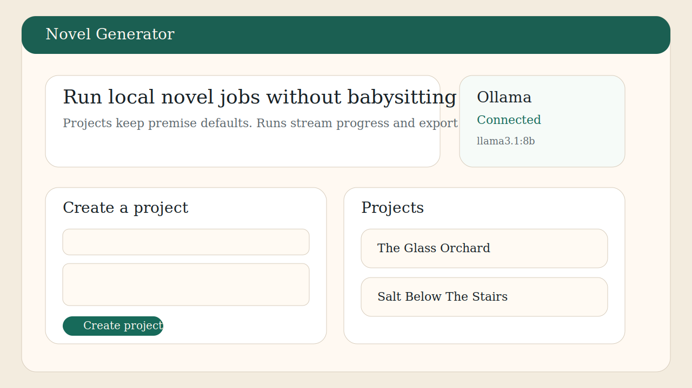

# Novel Generator

Novel Generator is a self-hosted, Ollama-first writing studio for long-form fiction. It lets a single author create reusable projects, queue background generation runs, stream progress in the browser, persist chapter-by-chapter state, and export finished manuscripts as Markdown and DOCX.



## What It Ships

- FastAPI backend with a server-rendered UI
- SQLite-first persistence with Alembic migrations
- Background worker process for queued generation runs
- Ollama provider integration with model discovery and health checks
- Chapter-level checkpointing and regeneration from any chapter onward
- Markdown and DOCX artifact export
- Docker Compose setup for self-hosting

## Quick Start

1. Copy `.env.example` to `.env`.
2. Set `OLLAMA_BASE_URL` and `DEFAULT_MODEL`.
3. Start the app:

```bash
docker compose up --build
```

4. Open [http://localhost:8000](http://localhost:8000).

If you want Ollama in the same compose stack, enable the optional profile and point `OLLAMA_BASE_URL` at `http://ollama:11434`:

```bash
docker compose --profile ollama up --build
```

## Local Development

Use Python 3.11+.

```bash
python -m venv .venv
. .venv/bin/activate
python -m pip install --upgrade pip
python -m pip install -e .[dev]
cp .env.example .env
uvicorn novel_generator.main:app --reload
python -m novel_generator.worker
pytest
```

On Windows PowerShell, activate the environment with `.venv\Scripts\Activate.ps1`.

## API Surface

- `GET /api/health`
- `GET /api/providers/ollama/status`
- `GET /api/providers/ollama/models`
- `POST /api/projects`
- `GET /api/projects/{id}`
- `POST /api/runs`
- `GET /api/runs/{id}`
- `POST /api/runs/{id}/cancel`
- `GET /api/runs/{id}/events`
- `GET /api/artifacts/{id}/download`

## Architecture

- `src/novel_generator/routers`: HTTP routes for the API and UI
- `src/novel_generator/services`: Ollama integration, prompts, pipeline, exports, and worker logic
- `src/novel_generator/repositories.py`: database-facing orchestration helpers
- `alembic/`: migration environment and schema history

The generation pipeline is:

1. Create or reuse an outline.
2. Plan a chapter.
3. Draft the chapter.
4. Summarize it for continuity memory.
5. Persist progress after each step.
6. Export Markdown and DOCX artifacts at the end.

## Self-Hosting Notes

- This release is intentionally optimized for a single-user deployment.
- It does not ship in-app auth. If you expose it publicly, place it behind a reverse proxy with authentication.
- SQLite is the default storage engine for easier local and home-lab deployments.

Additional docs:

- [Self-hosting](docs/self-hosting.md)
- [Backup and restore](docs/backup-and-restore.md)
- [Releasing](docs/releasing.md)

## Development Standards

- Apache-2.0 licensed
- Contributor Covenant code of conduct
- CI runs the pytest suite on pushes and pull requests

## Current Limits

- Only Ollama is implemented as a model backend in v1.
- Runs are processed sequentially by default to avoid oversubscribing local hardware.
- Chapter regeneration creates a new run from the selected chapter onward instead of mutating history in place.
