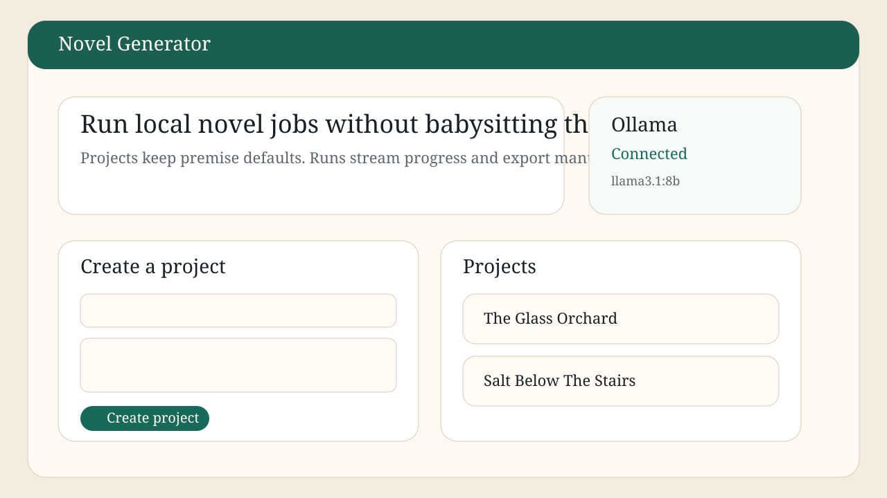

# Novel Generator

[](https://github.com/ProhibitedTV/Novel-Generator/actions/workflows/ci.yml)

Novel Generator is a self-hosted, local-first writing studio for generating, revising, auditing, and exporting full-length fiction with Ollama or an optional OpenAI-compatible local endpoint.

The product is built around one practical goal: get to a complete book draft, then make the draft increasingly coherent, reviewable, editable, and polished without losing the run history or long-form state that produced it.



## What It Ships

- FastAPI backend with a server-rendered UI
- SQLite-first persistence with automatic Alembic migrations
- Separate background worker for queued generation runs
- Ollama-first model integration with discovery and health checks
- Optional OpenAI-compatible routing for LM Studio, vLLM, and similar local servers
- Provider routing, per-stage attempt tracking, stale-worker recovery, and failed-run resume
- Run confidence views for stage, event, chapter, word, provider, and artifact progress
- Outline review workspace for long outlines, including 32- and 64-chapter projects
- Chapter-level checkpointing, in-place resume, and regeneration from any chapter onward
- Draft, balanced, strict, and publication quality profiles
- Bounded continuity memory, causal narrative horizons, long-range callback recall, and character/subplot arc audits
- Adaptive manuscript pacing, late-book convergence, and live continuity lifecycle cleanup
- Bounded whole-manuscript developmental and QA context
- Deterministic whole-book quality trends, ending-debt audits, and publication-readiness guards
- Schema-constrained structured output when the provider supports it, with compatibility fallbacks
- Context-headroom protection and stage-aligned completion budgets for local models
- Automatic continuation recovery for prose that stops because of provider output limits
- Safe prompt telemetry plus actual provider token, throughput, context, and stop metrics when available
- Deterministic 32-chapter long-form architecture benchmark
- Markdown and DOCX manuscript exports plus publication layout helpers with required front matter
- Docker Compose setup for self-hosting

## Verified Status

`main` is tested by GitHub Actions on every pull request and every push to `main`. CI uses Python 3.12, installs the package with `python -m pip install -e .[dev]`, and runs the full pytest suite.

The web process and worker both run Alembic migrations automatically at startup. For normal use you do **not** need to run `alembic upgrade head` yourself.

For an additional long-form architecture check that does not call an LLM, run:

```bash
python -m novel_generator.services.longform_benchmark
```

## Requirements

Choose one of the run modes below.

### Docker deployment

- Docker Engine / Docker Desktop with Compose v2 (`docker compose`)
- Ollama either:
  - running on the host machine, or
  - started with this repository's optional Compose profile

### Native Python deployment

- Python 3.11 or newer
- Ollama running locally, unless you plan to configure the optional OpenAI-compatible provider instead

## Run It

### Option A — Docker app + Ollama on the host (recommended)

This is usually the easiest local setup, especially when Ollama is already using your host GPU.

Clone the repository and create the environment file:

```bash
git clone https://github.com/ProhibitedTV/Novel-Generator.git
cd Novel-Generator
cp .env.example .env
```

On Windows PowerShell, use:

```powershell
git clone https://github.com/ProhibitedTV/Novel-Generator.git
cd Novel-Generator
Copy-Item .env.example .env
```

Edit `.env` and make sure these values match your Ollama installation:

```env
OLLAMA_BASE_URL=http://host.docker.internal:11434
DEFAULT_MODEL=llama3.1:8b
OLLAMA_NUM_CTX=32768
OLLAMA_NUM_PREDICT=8192
```

`host.docker.internal` is required here because `127.0.0.1` from inside the web/worker containers points back to the container, not to host Ollama. The included Compose file maps `host.docker.internal` through `host-gateway` for Linux Docker as well.

Make sure the selected model exists on the host:

```bash
ollama pull llama3.1:8b
ollama list
```

Replace `llama3.1:8b` with the model you actually want to use and set `DEFAULT_MODEL` to the same model name.

Start the web service and worker:

```bash
docker compose up --build
```

Open:

- App: <http://localhost:8000>
- Provider settings: <http://localhost:8000/settings/provider>

Verify the running services:

```bash
curl -fsS http://localhost:8000/api/health
curl -fsS http://localhost:8000/api/providers/ollama/status
```

To run in the background:

```bash
docker compose up -d --build
docker compose logs -f web worker
```

Persistent SQLite data and generated artifacts are stored in the `app_data` and `app_artifacts` Docker volumes.

### Option B — Run Ollama in the same Compose stack

Create `.env` as above, then set:

```env
OLLAMA_BASE_URL=http://ollama:11434
DEFAULT_MODEL=llama3.1:8b
```

Start the optional Ollama profile with the app:

```bash
docker compose --profile ollama up -d --build
```

A fresh Ollama container does not contain your model yet. Pull it explicitly:

```bash
docker compose exec ollama ollama pull llama3.1:8b
```

Then verify the provider from the app:

```bash
curl -fsS http://localhost:8000/api/providers/ollama/status
```

Follow app logs with:

```bash
docker compose logs -f web worker ollama
```

The repository's Compose file does **not** currently declare GPU passthrough for the `ollama` service. If you want containerized Ollama to use a GPU, configure Docker/NVIDIA or the appropriate accelerator support for your platform. Using host Ollama with Option A avoids that Compose-specific setup.

### Option C — Native Python

Create a virtual environment and install the application:

```bash
git clone https://github.com/ProhibitedTV/Novel-Generator.git
cd Novel-Generator
python -m venv .venv
. .venv/bin/activate
python -m pip install --upgrade pip
python -m pip install -e .[dev]
cp .env.example .env
```

On Windows PowerShell:

```powershell
git clone https://github.com/ProhibitedTV/Novel-Generator.git
cd Novel-Generator
python -m venv .venv
.\.venv\Scripts\Activate.ps1
python -m pip install --upgrade pip
python -m pip install -e ".[dev]"
Copy-Item .env.example .env
```

For native Ollama on the same machine, the example default is correct:

```env
OLLAMA_BASE_URL=http://127.0.0.1:11434
DEFAULT_MODEL=llama3.1:8b
```

Pull the model if needed:

```bash
ollama pull llama3.1:8b
```

Start the web process in terminal 1:

```bash
novel-generator-web
```

Start the worker in terminal 2, using the same virtual environment and `.env`:

```bash
novel-generator-worker
```

The equivalent explicit commands are:

```bash
uvicorn novel_generator.main:app --host 0.0.0.0 --port 8000
python -m novel_generator.worker
```

Open <http://localhost:8000>.

Both entrypoints automatically migrate the database to the current Alembic head before serving or processing work.

## First-Launch Checklist

For a reproducible real-model check using the worker's complete generation safeguards, run:

```bash
python -m novel_generator.services.local_verification --model qwen2.5:7b
```

Use an exact installed Ollama model name. This writes a fresh database, Markdown/DOCX manuscript,
QA report, and `report.json` under a new `artifacts/local-verification-*` directory. It does not use
your normal project database or change `.env`. The default is a three-chapter, 1,500-word smoke
test using automatic editing; `--chapters 24 --words-per-chapter 2500 --profile autonomous` exercises a 60,000-word target.
Long runs can take multiple days. Automatic repair defaults allow 12 draft attempts per chapter
and 24 final repair rounds, with persisted budgets and cycle detection. Use `--project-file`
with a project JSON for your own premise, genre, and length targets; sample 60,000-word briefs
are in `examples/novels`. `--review-model` and `--revision-model` select separate installed
Ollama models for those tasks. `--base-url`, `--context-tokens`, and `--output-dir` are configurable;
the output directory must not already exist. A zero exit code means all requested chapters,
continuity checkpoints, and export formats were produced. Inspect the report's actual word count,
fallback events, final QA, and prose separately before judging consistency or novel-length success.

Before starting a long novel run:

1. Confirm `GET /api/health` succeeds.
2. Open `/settings/provider` and verify Ollama reports healthy.
3. Refresh the detected model list and confirm the model you intend to use is available.
4. If you use an OpenAI-compatible endpoint, configure and enable it on the Provider Settings page before routing stages to it.
5. Create a short draft-profile project first if you want a cheap end-to-end smoke test before launching a 32- or 64-chapter book.

The web UI can save provider base URLs, default models, API keys, and enable/disable state. Ollama is enabled by default; the OpenAI-compatible provider is disabled by default until you enable it.

## Important Configuration

The complete example is in `.env.example`. These are the settings most likely to matter when running locally:

| Variable | Default | Purpose |
| --- | --- | --- |
| `DATABASE_URL` | `sqlite:///./data/novel_generator.db` in `.env.example` | SQLite database location. |
| `ARTIFACTS_DIR` | `./artifacts` | Export/artifact directory. |
| `OLLAMA_BASE_URL` | `http://127.0.0.1:11434` | Ollama API URL. Use `host.docker.internal` for Docker-to-host Ollama and `http://ollama:11434` for the Compose Ollama profile. |
| `DEFAULT_MODEL` | `llama3.1:8b` | Default Ollama model name. The model must already exist in Ollama. |
| `OLLAMA_NUM_CTX` | `32768` | Requested Ollama context window. Lower this if your model/hardware cannot support it. |
| `OLLAMA_NUM_PREDICT` | `8192` | Provider-wide Ollama completion ceiling. Stage budgets may lower it per call. |
| `OLLAMA_STRUCTURED_TEMPERATURE` | `0.2` | Lower temperature for structured control stages. |
| `OPENAI_COMPATIBLE_CONTEXT_TOKENS` | `0` | App-side context-window hint for LM Studio/vLLM/etc. `0` means unknown. This is not sent to the server. |
| `OPENAI_COMPATIBLE_MAX_TOKENS` | `8192` | Provider-wide completion ceiling for OpenAI-compatible calls. |
| `MAX_CONCURRENT_RUNS` | `1` | Maximum concurrent runs; keep this low for local hardware. |
| `NOVEL_CONTEXT_HEADROOM_ENABLED` | `1` | Shed optional derived prompt context when a known context window would otherwise starve output. |
| `NOVEL_CONTEXT_HEADROOM_RESERVE_TOKENS` | `8192` | Desired output reserve before provider calls. |
| `NOVEL_STAGE_OUTPUT_BUDGETS_ENABLED` | `1` | Allow each stage to lower the provider-wide completion ceiling to an appropriate size. |
| `NOVEL_TRUNCATION_RECOVERY_ENABLED` | `1` | Continue prose when the provider explicitly reports an output-length stop. |
| `NOVEL_TRUNCATION_MAX_CONTINUATIONS` | `2` | Maximum automatic prose continuation attempts after a length stop. |
| `SECRET_KEY` | development default | Change this before any public deployment. |

Stage-aligned output ceilings are bounded by the provider-wide maximum. With the default 8192-token ceiling, prose can use the full budget, large structured stages can use up to 6144, story-bible work up to 4096, chapter plan/critique/continuity stages up to 3072, and chapter summaries up to 2048.

See [Long-form output reliability](docs/output-reliability.md) for the exact context-headroom, structured-output, truncation-recovery, final-QA, and publication-guard behavior.

## Optional OpenAI-Compatible Provider

Ollama is the default provider. A second OpenAI-compatible provider can be enabled for endpoints such as LM Studio or vLLM.

The easiest setup is through <http://localhost:8000/settings/provider>:

1. Enable the OpenAI-compatible provider.
2. Enter its base URL (normally ending in `/v1`).
3. Set its default model name.
4. Add an API key if your endpoint requires one.
5. Save, test the connection, and then assign pipeline stages to that provider as desired.

The application uses schema-constrained `response_format` when supported. On local servers with a smaller OpenAI-compatible surface, JSON schema, JSON-object mode, and `max_tokens` controls fall back independently on HTTP 400/422 responses instead of making the endpoint unusable.

If you know the loaded model's real context size, set `OPENAI_COMPATIBLE_CONTEXT_TOKENS`; otherwise leave it at `0`. That setting is used only for app-side headroom/telemetry and is never sent as a nonstandard API field.

## First Run

1. Open the dashboard and create a project with a premise, target word count, chapter count, genre, and model.
2. Confirm provider health before queueing. Autonomous mode runs without outline approval; other profiles can pause for outline review.
3. Choose a quality profile:
   - `draft`: fastest route to a complete manuscript. Best for exploring a premise.
   - `autonomous`: UI default. Automatically repairs chapters, rebuilds continuity after revisions, and withholds completion and final manuscript exports until chapter and whole-book checks pass.
   - `balanced`: API compatibility default. Standard QA, developmental planning, targeted revisions, and final chapter editing.
   - `strict`: stronger revision thresholds for a more conservative editorial pass.
   - `publication`: highest-cost path. Forces outline approval, developmental rewrite, character humanization, prose compression, final editing, and a final publication-readiness QA gate.
4. Keep the worker running. The run page shows current stage, last event, provider route, chapter progress, word progress, attempts, artifacts, and recovery guidance.
5. If a run fails, resume from checkpoint when available. Already completed chapters, summaries, continuity updates, attempts, and events are preserved.
6. Review the final QA report before treating an export as finished prose. Publication exports are layout helpers, not an automatic claim of publishability.

## Quality Profiles

See [Unattended novel generation](docs/autonomous-editing.md) for automatic
editing, local reviewer routing, repair limits, and acceptance reports.

The profiles trade speed for editorial pressure.

| Profile | Best for | Behavior |
| --- | --- | --- |
| `autonomous` | Unattended generation and editing | Evidence-based reviews, bounded automatic repairs, continuity reconstruction, final chapter and book acceptance checks. Unresolved failures preserve work and diagnostics without exporting a completed manuscript. |
| `draft` | Fast exploration | Defers non-blocking polish so long runs reach a complete manuscript sooner. |
| `balanced` | Normal complete drafts | Uses standard chapter QA, developmental rewrite planning, targeted revision waves, and final editing. |
| `strict` | More cautious drafts | Tightens revision triggers and enables developmental rewrite by default. |
| `publication` | Serious editorial review | Adds outline approval, character-private-life requirements, scene-variety rules, motif budgets, humanization, compression, final editing, ending-debt review, and readiness scoring. |

Publication mode is intentionally expensive. It is designed to address generated-manuscript weaknesses such as repeated atmosphere, looped crisis structure, allegorical characters, over-explained prose, thin ordinary human friction, and misleading publication exports. If deterministic or model QA still finds major risk, the run remains exportable for human review but is labeled as needing editorial revision instead of claiming to be publication-ready.

## Model Benchmarks

The app can route individual runs to any model reported by Ollama. Benchmark results below are from a controlled local smoke through the app's provider path and attempt ledger; they are useful for routing decisions, not a general leaderboard.

Benchmark environment:

- Date: 2026-05-31
- Host: Windows 10 10.0.19045 with Docker Desktop 4.74.0 / WSL2, Docker Engine 29.4.3
- CPU: AMD Ryzen 7 2700X, 8 cores / 16 threads, up to 3.8 GHz
- RAM: 32 GiB
- GPU: NVIDIA GeForce RTX 3060, 12 GiB VRAM, driver 610.47
- App path: Docker Compose `web` container, temporary SQLite database, Ollama at `http://host.docker.internal:11434`
- Benchmark fixture: 2-chapter balanced project plus a 64-chapter long-context outline review probe

`gemma4:e4b` metadata:

- Official library page: [Ollama gemma4:e4b](https://ollama.com/library/gemma4%3Ae4b)
- Local Ollama metadata: `gemma4` family, 8.0B parameters, `Q4_K_M`, 131,072 token context
- Local model size: about 9.6 GB

| Model | Full benchmark time | Structured stages | Prose stages | 64-chapter review | JSON repair usage |
| --- | ---: | ---: | ---: | ---: | ---: |
| `gemma4:e4b` | 20.2 min | 15.2 min | 4.3 min | 79.8 sec | 1 story-bible repair |
| `qwen3:14b` | 70.1 min | 54.5 min | 13.2 min | 525.9 sec | 0 |
| `gpt-oss:20b` | 91.2 min | 65.6 min | 12.6 min | 534.1 sec | 0 |

Current routing guidance:

- Keep the configured default model unchanged until more end-to-end manuscripts are reviewed.
- `gemma4:e4b` is a strong manual choice for fast draft-profile runs and support stages.
- Watch story-bible generation closely with `gemma4:e4b`; the benchmark completed successfully, but one story-bible call needed JSON repair before validation.

## Long-Form Architecture Benchmark

The repository includes a deterministic synthetic 32-chapter stress benchmark for the context/state architecture. It makes no inference call and does not measure prose quality or model speed.

```bash
python -m novel_generator.services.longform_benchmark
```

The benchmark verifies continuity compaction, buried callback recall, dormant unresolved character detection, future arc visibility, adaptive manuscript pacing, late-book resolution priority, bounded developmental/QA whole-book coverage, and deliberate final-third quality/length drift detection. It prints a JSON report and exits non-zero if an architectural check fails.

See [Long-form benchmark and generation telemetry](docs/longform-benchmark.md), [Bounded novel memory](docs/novel-memory.md), [Continuity state lifecycle](docs/continuity-lifecycle.md), and [Long-form output reliability](docs/output-reliability.md).

## Verify a Development Checkout

After `python -m pip install -e .[dev]`:

```bash
pytest
python -m novel_generator.services.longform_benchmark
```

CI runs `pytest` automatically on pull requests and pushes to `main`. The deterministic benchmark is covered by pytest as well, while the direct command is useful when you want its human-readable JSON diagnostics.

## API Surface

- `GET /api/health`
- `GET /api/providers/ollama/status`
- `GET /api/providers/ollama/models`
- `POST /api/projects`
- `GET /api/projects/{id}`
- `PATCH /api/projects/{id}`
- `POST /api/runs`
- `GET /api/runs/{id}`
- `POST /api/runs/{id}/cancel`
- `POST /api/runs/{id}/rerun`
- `POST /api/runs/{id}/resume`
- `GET /api/runs/{id}/attempts`
- `GET /api/runs/{id}/events`
- `GET /api/artifacts/{id}/download`

## How Generation Works

Relevant code lives in:

- `src/novel_generator/routers`: HTTP routes for the API and UI
- `src/novel_generator/services`: providers, prompts, long-form runtime layers, pipeline, exports, and worker logic
- `src/novel_generator/repositories.py`: database-facing orchestration helpers
- `alembic/`: migration environment and schema history

At a high level, a complete run works like this:

1. Create or reuse a story bible and outline using schema-constrained structured generation when supported.
2. Pause for outline review when requested, or automatically for publication runs.
3. For each chapter, assemble bounded continuity memory, causal horizon, recent/long-range recall, and arc context.
4. Reserve output headroom when the provider context window is known and apply a stage-appropriate completion ceiling.
5. Plan, draft, critique, revise when required, summarize, and update the live continuity ledger.
6. If prose ends because the provider reports a length/token limit, attempt bounded continuation recovery rather than silently accepting an incomplete chapter.
7. Persist checkpoints, stage attempts, events, safe prompt telemetry, and provider-reported usage/stop metrics.
8. Run bounded whole-manuscript QA with every chapter represented, plus unresolved-arc and deterministic quality-trend signals.
9. Build a developmental rewrite plan and apply targeted structural revision waves.
10. Reconcile summaries and continuity checkpoints only for structurally revised chapters, then replay the durable ledger in chapter order.
11. For publication runs, perform character humanization and prose compression waves.
12. Final-edit each saved chapter; deterministic guards can roll back empty, catastrophically resized, or newly corrupted line edits.
13. Run final manuscript QA against accepted final prose, including an end-of-book story-debt audit.
14. Apply the publication-readiness guard. Central unresolved ending debt, severe length problems, or other deterministic blockers prevent a false `publication-ready` label while leaving the manuscript exportable for human review.
15. Export Markdown, DOCX, QA reports, revised outlines, and publication layout helpers as artifacts.

## Publication Exports

Publication export profiles are layout helpers, not a promise that the manuscript is ready to sell. The export form requires:

- Author name
- Copyright year
- Publisher or imprint
- Dedication
- Author note

ISBN is optional. If ISBN is blank, the ISBN line is omitted. Bracketed placeholder text such as `[Author Name]` is rejected so generated exports cannot silently ship placeholder front matter.

## Self-Hosting Notes

- This release is intentionally optimized for a single-user deployment.
- It does not ship in-app authentication. If you expose it publicly, place it behind a reverse proxy with authentication.
- Change `SECRET_KEY` before exposing the app beyond a trusted local environment.
- SQLite is the default storage engine for easier local and home-lab deployments.
- Docker Compose persists the SQLite database and artifacts in named volumes.
- Keep `MAX_CONCURRENT_RUNS=1` unless you know your inference hardware can safely handle overlapping generation jobs.

Additional docs:

- [Self-hosting](docs/self-hosting.md)
- [Backup and restore](docs/backup-and-restore.md)
- [Releasing](docs/releasing.md)
- [Long-form benchmark and generation telemetry](docs/longform-benchmark.md)
- [Bounded novel memory](docs/novel-memory.md)
- [Continuity state lifecycle](docs/continuity-lifecycle.md)
- [Long-form output reliability](docs/output-reliability.md)

## Development Standards

- Apache-2.0 licensed
- Contributor Covenant code of conduct
- CI runs the pytest suite on pushes to `main` and on pull requests

## Current Limits

- Ollama remains the primary local-first backend. OpenAI-compatible routing must be explicitly enabled.
- Runs are processed sequentially by default to avoid oversubscribing local hardware.
- Chapter regeneration creates a new run from the selected chapter onward instead of mutating prior run history.
- Provider context/output settings cannot make a model or GPU support a context window that the underlying runtime cannot actually sustain; tune `OLLAMA_NUM_CTX`, output ceilings, and concurrency for your hardware.
